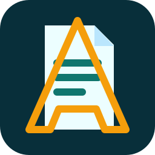

# ATLAS Plugin Repository Demo

Public demo repository for testing the ATLAS plugin repository workflow.

[](https://rockbaer2007.github.io/atlas-plugin-repository-demo/install.html)

[](https://rockbaer2007.github.io/atlas-plugin-repository-demo/install.html)

## Repository URL

Use this URL in ATLAS Administration:

```text
https://raw.githubusercontent.com/rockbaer2007/atlas-plugin-repository-demo/main/repository.json
```

The page explains the ATLAS repository flow and copies the `repository.json`
URL for Administration.

## Plugins



<p>
  <strong>ATLAS Simple File Editor</strong><br>
  Plugin ID: <code>atlas.demo.simple-file-editor</code><br>
  Version: <code>0.1.14</code>
</p>


<p>
  <strong>ATLAS File Studio</strong><br>
  Plugin ID: <code>atlas.plugin.file-studio</code><br>
  Version: <code>0.1.3</code>
</p>

## Contents

```text
repository.json
assets/
  atlas-repository-button.svg
plugins/
  simple-file-editor/
    atlas-plugin.json
    simple-file-editor.atlas-plugin.json
    icon.svg
    logo.svg
    preview.svg
    README.md
```

The demo catalog also links to the independent ATLAS File Studio plugin
repository:

```text
https://github.com/rockbaer2007/atlas-file-studio-plugin
```

## Purpose

This repository is the first public reference for:

- the `repository.json` catalog format
- plugin icon, logo and preview metadata
- package install/update/remove testing
- a second real plugin entry through ATLAS File Studio
- a future reusable ATLAS plugin template

The demo plugin is metadata-only in the first Administration preview and does
not execute plugin code yet.

## Asset Convention

- `icon.svg`: compact square plugin icon for lists and small status rows.
- `logo.svg`: wide ATLAS-branded plugin logo for Hub/Admin cards.
- `preview.svg`: 16:9 plugin preview or screenshot.
